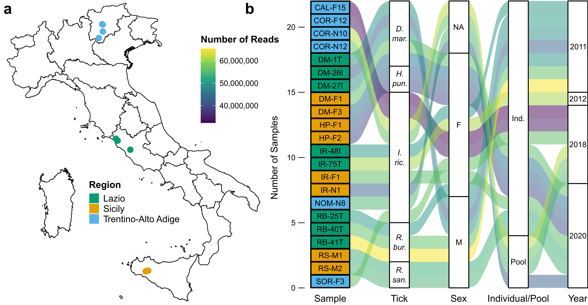

# TickVirome_IT
Analysis of tick viromes from Italy.

Metatranscriptome-assembled viral contigs (_n_ = 99) and annotations from ticks sampled across multiple locations in Italy are available on Zenodo:

